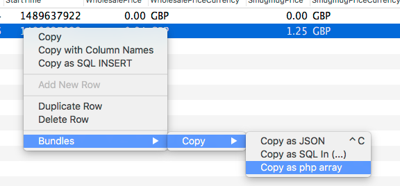

# [cabbey's Sequel Pro bundles](https://github.com/cabbey/SequelProBundles)
## Copy tools

These bundles show up in the Bundle Copy menu of query results.

For best results, you should only use these when selecting a single column from your table.
